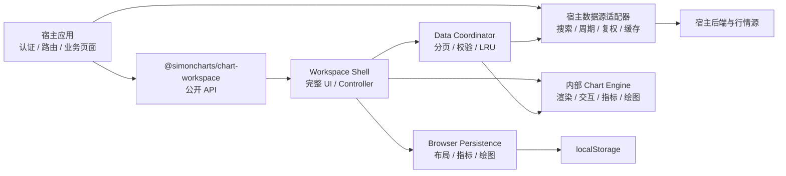

# SimonCharts Commercial Chart Workspace SDK Design

## 0. RC.22 现行产品合同（2026-07-19，优先于下文历史合同）

本规格原先把合作方产品定义为默认全功能 Workspace。该形态已被真实复盘宿主否决：工具复杂度过高，图表与业务动作割裂。`1.0.0-rc.2` 至 `rc.8` 完成嵌入式产品重置、分时/连续历史、量柱着色、宿主 view/range/event 合同与并发隔离；`rc.9` 把显式 advanced 模式重建为 Advanced Charts 类图表工作台；`rc.10` 至 `rc.20` 依次完成多日分时、Advanced Charts 类交互与普通 K 线有界缩放；`rc.21` 从生产包移除行情 fixture；当前 `rc.22` 以真实多日分时的等宽交易日槽、日内均线和统一坐标完成呈现收敛，继续坚持真实数据为空即为空。下文凡与本节冲突的旧包名/API、默认完整工作台、悬浮绘图窗、横向底部面板和 1280 px 最小宽度描述均视为历史记录，不再是现行合同。

现行定位是 Advanced Charts 类可嵌入 SDK：

```ts
import {
  createChart,
  advancedChartFeatures,
  type ChartDatafeed,
  type ChartOptions,
  type ChartInstance
} from "@simoncharts/charts";

const chart: ChartInstance = createChart(container, {
  chartId: "review-detail",
  persistenceScopeId: userId,
  dataContextId: snapshotRevision,
  initialSymbol,
  datafeed,
  theme: "light",
  locale: "zh-CN"
});
```

现行分时公开合同：

```ts
export type IntradayDayCount = 1 | 2 | 3 | 4 | 5 | 6 | 7 | 8 | 9;

export interface ChartIntradayScale {
  readonly previousClose: number;
  readonly priceLimitPercent?: number;
}

export interface ChartDataCapabilities {
  readonly series: readonly ChartDataSeriesCapability[];
  readonly intradayScale?: ChartIntradayScale;
}

chart.setView("intraday");
chart.setIntradayDays(5);
```

- 唯一公开创建入口是 `createChart(container, options)`；不提供旧 API 兼容层。
- 公开主类型是 `ChartDatafeed`、`ChartOptions`、`ChartState`、`ChartInstance`，错误类型是 `ChartDatafeedError` 与 `ChartError`。
- 默认 features 精确为 `timeframes`、`adjustment`、`indicators`；宿主负责选股和业务流程。
- `ChartFeature` 稳定集合为 `symbol-search`、`timeframes`、`adjustment`、`series-type`、`price-scale`、`indicators`、`drawing-tools`、`drawing-history`、`settings`、`bottom-panel`。
- feature 控制真实 DOM 构造和事件绑定；关闭的工具不得创建后隐藏。默认不得出现原始图表枚举、固定绘图轨、撤销重做、设置或右侧检查器。
- `advancedChartFeatures` 是显式完整工作台开关，继续覆盖 17 种图表、16 个指标、63 个真实绘图工具和 3 种价格刻度；17 种图形与 63 个绘图工具均以双语菜单和可见的语义 SVG 图标呈现。
- 菜单只能暴露 Engine 已能创建、编辑、序列化和恢复的绘图工具；不得为对齐参考产品而伪造未实现工具或放置不可工作的锁定占位项。
- `theme` 稳定支持 `dark | light`，`locale` 稳定支持 `zh-CN | en-US`，图表必须随容器响应式工作。
- cutoff、dataVersion、分页、持久化隔离、安全错误、取消和销毁合同全部沿用。
- 生产 SDK 不提供、不生成也不回退到任何行情 fixture；只渲染宿主 datafeed 返回并通过校验的真实数据。宿主真实数据为空时保持空状态，不复制、插值或构造 K 线。确定性 fixture 只允许存在于测试、脚本和私有 playground，不得进入生产包导出或运行路径。
- 周期组在 capability 含 `1m` 时按 `分时 / 1分 / 5分 / 15分 / 30分 / 60分 / 日 / 周 / 月` 呈现；`分时`和 2–9 日分时固定为同一 `1m` revision 的 close 折线，普通周期默认蜡烛图。最简模式不得持久化该临时 line，高级模式的手工系列类型选择继续持久化。
- advanced 周期下拉承载完整 capability 集，星标只决定固定顺序的外部快捷项且最多四个；尝试固定第五个时保持原偏好不变并提示 `最多固定 4 个周期，请先取消一个`。已固定但当前 symbol 不支持的周期仍须在菜单中可见并允许取消固定。
- `ChartState.view` 明确区分 `intraday | timeframe`，`ChartState.intradayDays` 使用 `IntradayDayCount`；宿主可用 `setView`、`setIntradayDays`、`getVisibleRange`、`setVisibleRange`、`resetToLatest` 和 `subscribeEvents` 与业务状态联动。
- 宿主通过 capability 的 `intradayScale` 返回当前 symbol 与 cutoff 下有限且大于零的官方 `previousClose`；`priceLimitPercent` 存在时必须在 `(0, 100]` 内并表示当前交易日适用的固定涨跌幅，不存在时表示不应用固定幅度。板块、风险警示、上市日和规则生效日判断均属于宿主，SDK 不硬编码交易所规则。
- 单日分时以宿主 `previousClose` 为 `0%`；有 `priceLimitPercent` 时纵轴固定对称显示 `-limit% … 0% … +limit%`，未提供幅度时按真实行情自动缩放，覆盖新股等无固定幅度场景。
- 分时左轴显示真实价格、右轴显示相对区间基准的涨跌幅；主线按窗口末值相对基准统一显示上涨红、下跌绿、平盘中性色。黄色分时均线按每个上海交易日分别累计真实成交额/真实成交量，跨交易日归零重算。1–9 日分时始终完整 fit，用户滚轮、拖拽、价格/时间轴、键盘或宿主 `setVisibleRange` 均不得缩放或平移分时窗口。
- 普通分钟周期按视口需求跨交易日连续分页；多日分时从同一真实 `1m` revision 解析最新 2–9 个交易日，以所选最早交易日前一真实交易日的最后一根分钟收盘为 `0%`。每个真实交易日占相同宽度并使用 242 个中心对齐的交易时段槽位，午休被压缩但 11:30 与 13:00 不重叠；真实日边界显示分隔线，价格线跨边界连续。价格、分时均线、量柱和十字光标共用该时间坐标，涨跌幅轴按真实窗口最大绝对偏离保持上下对称。
- SDK 为多日窗口加载足以识别 N 个目标交易日及其前一基准日的游标历史；宿主实际数据不足 N 日时只展示现有真实交易日，不填充自然日、不插值、不复制或合成 K 线。
- advanced 模式的固定信息架构为 `40px 顶栏 / 44px 左绘图轨 / 中央图表 / 默认折叠的 40px 右检查器 / 26px 状态栏`；绘图区在图表头下预留 34 px 上边距，边界刻度必须完整且不得与 OHLC 头重叠；右检查器只承载对象、属性和数据窗口。
- 普通 K 线位于 latest 视口时，任何缩放都保持 `to = lastIndex`、`scrollOffset = 0`；只有用户先向历史平移后，缩放才围绕交互锚点保持历史位置。缩小的响应式可见数量上限为 `floor(plotWidth / 2)`，柱宽不得小于 2 px；到达下限时首末实际 K 线/日期边缘贴合绘图区两侧，索引不得为负，继续缩小必须幂等。滚轮、键盘、时间轴拖动、容器 resize 和宿主 `setVisibleRange` 共用同一约束。
- 十字光标的垂直虚线必须连续贯穿主图和独立量柱区，横线只留在主图；普通 K 线头显示 OHLC 与涨跌额/涨跌幅，悬浮数据窗显示日期、OHLC、涨跌额/涨跌幅、振幅、位置、成交量和成交额，并随 `zh-CN | en-US` locale 本地化。平移保持同一捕获手势，滚轮/键盘缩放、价格轴纵拖、时间轴横拖、双击复位、绘图命中/整体/锚点编辑、右键菜单和原生全屏均为 SDK 行为。
- Charts 不构造观察列表、资讯、经纪商、订单、账户或多图交易布局；这些属于宿主或 Trading Platform 产品面。

当前交付候选为 `@simoncharts/charts@1.0.0-rc.22`。默认嵌入模式用于 TradingReviewSystem 业务详情；独立高级图表页必须显式传入 `advancedChartFeatures`。

> 状态：rc.22 已完成不可变制品与 package/browser 门禁。33 文件制品 SHA-256 为 `f87be50ae320476e8a9d69329f28d6d0c84bc7d30f1c1ba0b9e7cc1a24e37238`，SHA-512 为 `b3e5180a7b97d1f5f8975224125f0552a42fb6fc010c3fe47e4cc0ccd8870ef39660f29a141fde1ce21b00c86246a4a87a9487dae30617d137001c4c9889f20a`；Vitest 68 文件/1,087 项、合并 Chrome 92/92、Charts Chrome/Edge 各 41/41、Charts unit 13 文件/114 项、Engine 162 runtime exports/415 type symbols、Charts 5 runtime exports/4 declarations 通过。生产 SDK 仍无 runtime mock、补点或行情构造；rc.21 及更早版本继续作为不可变历史候选保留。

## 1. 背景与问题

SimonCharts 当前已经具备一套宿主无关的金融图表内核：17 种图表类型、16 个指标、63 个绘图工具，以及渲染、交互、扩展、序列化和发布验证基础。现有 `apps/playground` 是内核验收工具，不是可以直接交付给合作方的产品界面。

合作方真正需要的不是一组低层渲染零件，而是一个可直接嵌入浏览器应用、带完整工作台 UI、数据接入合同和商业交付物的 SDK。当前内核还存在两类产品化缺口：

- 宿主必须手工组装画布、调度器、交互、绘图、状态和工具栏，无法做到开箱即用。
- 部分已声明能力尚未形成端到端闭环，例如连续绘图指针生命周期、部分命令归约和非线性价格刻度。

本设计将低层内核保留为内部实现基础，在其上新增唯一面向合作方的完整工作台 SDK，并以 TradingReviewSystem 的独立 `/chart` 页面作为第一个真实宿主验收。

## 2. 目标

交付私下分发的商业包 `@simoncharts/chart-workspace`，让合作方完成以下三步即可得到完整图表工作台：

1. 从本地 `.tgz` 安装固定版本。
2. 实现能力声明、标的搜索和序列加载三项数据源方法并引入默认样式。
3. 调用 `createChartWorkspace(container, options)`。

完成后的工作台必须：

- 在桌面 Chromium 浏览器中提供专业、紧凑的暗色行情终端界面。
- Engine 和 Workspace 保留全部已确认周期、图表、指标和绘图技术能力；每个真实宿主只暴露其 `getCapabilities` 精确声明且有授权数据支撑的周期/复权子集。
- 按需分页访问数据源的全部历史，不预载全部历史，也不生成任何虚假行情。
- 将布局、指标参数、绘图和 UI 偏好仅保存在当前浏览器。
- 保持宿主无关，不包含 TradingReviewSystem 的认证、路由、后端或业务模型。
- 通过外部包消费、真实宿主、能力矩阵、浏览器和性能验收后，生成可控分发的版本化 `.tgz`。

## 3. 产品形态与交付边界

### 3.1 面向合作方的唯一入口

- 合作方只依赖 `@simoncharts/chart-workspace`。
- `@simoncharts/chart-engine` 继续作为仓库内部内核，不要求也不允许合作方直接组装其运行时模块。
- workspace 构建产物内含运行所需的 engine 代码，合作方不需要再安装或导入 engine 包。
- SDK 使用框架无关的 DOM 挂载 API，可嵌入 React、Vue 或原生 Web 应用。

### 3.2 商业分发

- 每个正式版本通过 `npm pack` 生成版本化 `.tgz`，由项目方人工私下交付。
- 合作方从本地文件安装，并在 lockfile 中锁定精确版本。
- 包标记为 `UNLICENSED`，授权来自商业合同和受控交付。
- v1 不实现运行时许可证密钥、域名绑定、设备绑定或在线授权校验。
- 文件名和包元数据使用一致的精确 SemVer；预发布包只用于验收，不覆盖已交付的正式版本。

### 3.3 不在 v1 范围内

- 实时行情、WebSocket、逐笔或盘口。
- ETF、基金、期货、期权、外汇和加密资产。
- 观察列表、资讯、AI 分析、策略中心、交易下单、账户和会员系统。
- 服务端布局或绘图同步、跨设备同步、多人协作。
- 移动端、触摸优先交互和响应式窄屏产品形态。
- Safari 和 Firefox 的正式兼容承诺。
- 指标脚本市场或合作方运行任意代码的插件系统。

## 4. 责任边界



宿主负责：

- 身份认证、权限、路由和页面生命周期。
- 后端 API、数据供应商访问、缓存、周期聚合和复权计算。
- 决定哪些 A 股个股和主要指数可被搜索与访问。
- 将供应商错误转换成不暴露密钥、请求签名或内部地址的安全错误。

workspace SDK 负责：

- 完整工作台 UI、状态控制和快捷交互。
- 数据请求协调、取消、过期响应隔离、校验、分页合并和有界内存缓存。
- engine 的实例化、运行时组装、渲染调度和销毁。
- 浏览器本地布局、指标参数、绘图和 UI 偏好持久化。
- 统一的用户错误界面和结构化错误回调。

engine 负责：

- 序列渲染、坐标和面板计算。
- 指标计算与视觉输出。
- 十字光标、缩放、平移、命中测试和绘图编辑。
- 命令、撤销/重做、对象模型与序列化的底层语义。

## 5. 公开 API 合同

### 5.1 安装与挂载

```ts
import {
  createChartWorkspace,
  type ChartWorkspaceDataSource,
} from "@simoncharts/chart-workspace";
import "@simoncharts/chart-workspace/styles.css";

const workspace = createChartWorkspace(container, {
  workspaceId: "trading-review-system",
  persistenceScopeId: authenticatedUserId,
  dataContextId: chartSnapshotRevision,
  initialSymbol,
  dataCutoffTime: reviewCutoffEpochMilliseconds,
  dataSource,
});

// 宿主页面卸载时调用 workspace.destroy()。
```

### 5.2 市场与数据类型

```ts
export type SymbolKind = "stock" | "index";
export type Exchange = "SSE" | "SZSE" | "BSE";

export type Timeframe =
  | "1m"
  | "5m"
  | "15m"
  | "30m"
  | "60m"
  | "1d"
  | "1w"
  | "1mo";

export type AdjustMode = "none" | "forward" | "backward";

export interface ChartDataSeriesCapability {
  timeframe: Timeframe;
  adjustModes: readonly AdjustMode[];
}

export interface ChartDataCapabilities {
  series: readonly ChartDataSeriesCapability[];
}

export interface ChartSymbol {
  id: string;
  code: string;
  name: string;
  exchange: Exchange;
  kind: SymbolKind;
}

export interface Candle {
  time: number;
  open: number;
  high: number;
  low: number;
  close: number;
  volume: number;
  turnover: number;
}

export interface SeriesRequest {
  symbol: ChartSymbol;
  timeframe: Timeframe;
  adjustMode: AdjustMode;
  beforeCursor?: string;
  dataCutoffTime?: number;
}

export interface SeriesPage {
  candles: readonly Candle[];
  beforeCursor?: string;
  hasMoreBefore: boolean;
  dataVersion: string;
}

export interface ChartWorkspaceDataSource {
  getCapabilities(
    symbol: ChartSymbol,
    signal: AbortSignal,
  ): Promise<ChartDataCapabilities>;

  searchSymbols(
    query: string,
    signal: AbortSignal,
  ): Promise<readonly ChartSymbol[]>;

  loadSeries(
    request: SeriesRequest,
    signal: AbortSignal,
  ): Promise<SeriesPage>;
}
```

合同语义：

- `ChartSymbol.id` 是宿主范围内稳定且唯一的标识；workspace 不解析供应商代码。
- `time` 使用 Unix epoch milliseconds；显示时按 `Asia/Shanghai` 交易时区格式化。
- `getCapabilities` 按周期声明精确复权集合，不使用两个独立数组形成笛卡尔积。能力未加载完成前不展示或请求任何行情组合；切换标的时取消旧能力与行情请求。
- `dataCutoffTime` 与 `time` 使用相同单位；提供后必须进入同一 workspace 实例的每个首屏和历史请求。SDK 同时校验响应，任一 K 线晚于截止时间时原子拒绝整页，首屏不进入可信状态，历史页不改变已有可信图形。
- 每页 `candles` 按时间严格升序且页内时间唯一。页面是原子合并单位：任一 K 线、页内重复、顺序或分页协议无效时拒绝整页，不过滤、修补或猜测数据。相邻页边界如包含同一时间，只在 OHLCV 和成交额完全一致时去重；数值冲突则拒绝新页。
- `beforeCursor` 是宿主定义的不透明游标。首个请求不传游标；向更早历史翻页时原样回传上页游标。
- `hasMoreBefore === true` 时，响应必须提供非空 `beforeCursor`，且它不能等于本次请求游标，也不能在当前分页链中重复出现。对于携带请求游标的历史页，页面必须至少包含一个早于当前最早 K 线的新时间点。违反任一条件即按无效整页处理，防止无限分页。
- `hasMoreBefore === false` 表示已经到达数据源可提供的最早历史，此时响应可不提供下一游标。
- 同一连续分页快照必须返回相同 `dataVersion`。版本变化时 workspace 不混合两个版本，而是重新从最新页建立可信快照。
- 宿主返回请求所指定的精确周期和复权结果；workspace 不识别 AKShare、Tushare 或其他供应商语义，也不自行聚合或复权。
- 搜索结果只允许 `stock` 和 `index`。主要指数集合由宿主决定，SDK 不硬编码指数清单。

### 5.3 创建参数与实例

```ts
export function createChartWorkspace(
  container: HTMLElement,
  options: ChartWorkspaceOptions,
): ChartWorkspace;

export interface ChartWorkspaceOptions {
  workspaceId: string;
  persistenceScopeId: string;
  dataContextId: string;
  initialSymbol: ChartSymbol;
  dataSource: ChartWorkspaceDataSource;
  initialTimeframe?: Timeframe;
  initialAdjustMode?: AdjustMode;
  dataCutoffTime?: number;
  onError?: (error: ChartWorkspaceError) => void;
}

export interface ChartWorkspaceState {
  symbol: ChartSymbol;
  timeframe: Timeframe;
  adjustMode: AdjustMode;
  loading: boolean;
  capabilities?: ChartDataCapabilities;
}

export type ChartWorkspaceStateListener = (
  state: Readonly<ChartWorkspaceState>,
) => void;

export interface ChartWorkspace {
  getState(): Readonly<ChartWorkspaceState>;
  setSymbol(symbol: ChartSymbol): void;
  setTimeframe(timeframe: Timeframe): void;
  setAdjustMode(adjustMode: AdjustMode): void;
  retry(): void;
  subscribe(listener: ChartWorkspaceStateListener): () => void;
  destroy(): void;
}
```

默认值与约束：

- 默认优先周期为 `1d`；宿主未声明时使用声明中的第一个周期。
- A 股个股默认优先使用 `forward`；当前周期未声明时依次选择 `none` 和第一个合法值。指数只允许 `none`。
- 如果宿主为指数传入其他复权值，workspace 归一化为 `none`，不显示错误，也不向数据源发送无效组合。
- 布局、偏好和指标以 `workspaceId + persistenceScopeId` 隔离；绘图额外加入必填 `dataContextId`。三者都不作为权限或许可证标识。
- `dataContextId` 是宿主提供的非敏感、不透明行情上下文标识。快照 revision 或历史截止上下文变化时必须变化，避免历史图形与当前行情图形串用；它不影响布局、偏好或指标。
- `setSymbol`、`setTimeframe` 和 `setAdjustMode` 先归一化输入；只有有效的标的、周期、复权组合发生变化时才产生新请求代际并取消旧请求。
- `retry()` 只重试当前 generation 的可恢复阻断操作：初始数据失败时重新请求首个无游标页面，渲染失败时用当前可信数据重建图形运行时。搜索和历史页失败由各自 UI 的重试操作处理；无可恢复阻断错误时 `retry()` 不执行任何操作。
- `destroy` 必须可重复调用，并同步移除 DOM、事件监听、观察器和计时器，同时取消未完成请求。
- `subscribe` 只通知订阅后的公开状态变化；初值由 `getState()` 获取。退订和 `destroy` 都必须停止后续通知。
- 所有公开类型从 workspace 包根入口导出；合作方不从内部路径导入。

## 6. 工作台 UI 与交互

### 6.1 空间结构

工作台填满宿主提供的容器，从上到下只有三个主要区域：

1. 顶部紧凑工具栏。
2. 占据主要空间的整块图形面板。
3. 位于图形下方的横向对象与属性面板。

不设置永久右侧栏。下方面板包含“对象”“属性”“数据窗口”三个页签；对象选择会联动属性页签，数据窗口展示十字光标所在时间点的行情和指标值。下方面板允许折叠和拖动分隔线调整高度，状态保存到浏览器。

顶部工具栏包含：

- 标的搜索与当前标的。
- 8 个周期选择。
- 个股的前复权、后复权、不复权选择；指数仅显示不复权状态。
- 17 种图表类型选择。
- 16 个指标的添加、参数和显隐入口。
- 撤销、重做、图表设置和下方面板开关。

图形面板包含 OHLC/涨跌信息、主图与副图、坐标轴、网格、十字光标、提示信息和绘图对象。它不被对象属性区域横向压缩。

### 6.2 悬浮绘图栏

- 63 个绘图工具全部从图形面板内的悬浮工具窗进入。
- 工具窗可在图形可视区域内拖动、折叠和展开。
- 工具分类在工具窗相邻位置展开，不占用永久侧栏。
- 拖动位置、折叠状态和最近使用工具保存在浏览器；窗口尺寸变化后位置会被限制回图形可视区域。
- 选中工具后支持预览、创建、完成、取消、命中、选择、编辑属性、删除、撤销/重做、序列化和恢复。
- 连续绘图工具必须完整处理 `pointerDown`、`pointerMove`、`pointerUp` 和取消路径，不能只创建静态占位对象。

### 6.3 视觉规范

视觉方向是专业、紧凑、低装饰的暗色交易终端：

- 页面背景：`#08090D`。
- 面板表面：`#15171C`。
- 边界与网格：低对比度冷灰，网格使用细点线。
- 选中和焦点强调色：`#6266F1`，只用于当前选择与交互反馈。
- A 股上涨：`#F04455`；下跌：`#00AA91`。
- 工具栏和控制区高度控制在 32–46 px，信息密度高但保持可点击间距。
- 行情数字使用等宽数字特性，文本层级通过明度而非大字号建立。
- 禁止大面积卡片切割、渐变霓虹、装饰性发光和侵占图形空间的营销元素。

v1 不使用 Shadow DOM。根节点固定带 `.sc-workspace`，内部 CSS 类统一使用 `sc-` 前缀；主题通过文档化 CSS variables 控制，默认主题无需合作方配置即可使用。

## 7. 完整能力范围

### 7.1 图表类型

正式 UI 必须可选择并正确运行现有 17 种类型：

- bars、candles、hollowCandles、volumeCandles。
- line、lineWithMarkers、stepLine、area、hlcArea、baseline。
- columns、highLow。
- heikinAshi、renko、lineBreak、kagi、pointAndFigure。

合成图表类型只改变渲染模型，不覆盖或伪造源 K 线，并保留源时间范围的可追溯性。

### 7.2 指标

- 现有 16 个指标全部进入正式指标选择、参数编辑、显隐、面板、图例、数据窗口和持久化闭环。
- 主图和副图输出遵循 engine 的面板与视觉输出合同。
- 周期、标的或复权变化后，用新数据重新计算；旧请求结果不得写回当前状态。

### 7.3 绘图

- 现有 63 个工具全部进入正式绘图栏和对象管理闭环。
- 实现阶段必须修复所有阻断完整交互的内核缺口，包括连续绘图指针生命周期、声明但未生效的命令路径，以及工作台暴露的刻度设置。

### 7.4 价格刻度

- v1 正式支持 `linear`、`log` 和 `percentage`，默认 `linear`；三种模式都必须进入 UI、浏览器持久化和能力矩阵测试，不得交付无效果控件。
- `log` 对绝对价格执行对数坐标变换；A 股和指数行情价格必须大于零，绘图对象仍以绝对价格保存。
- `percentage` 以当前可视区第一根源 K 线的收盘价为 `0%`，视口变化时重新确定显示基准；绘图对象同样以绝对价格保存。
- 三种模式都必须完成坐标轴、自动缩放、系列、指标、十字光标、命中测试、绘图渲染与编辑的同一变换闭环。

## 8. 数据加载与内存模型

### 8.1 首屏和历史分页

1. 创建 workspace 后，对初始标的、周期和复权发起无游标请求。
2. 首个有效页面通过校验后立即形成首个可交互画面。
3. 当视口接近当前最早已加载边界时，使用 `beforeCursor` 请求更早一页。
4. 新页验证后按时间合并、去重，并保持当前视口锚点不跳动。
5. 重复上述过程，直到 `hasMoreBefore` 为 false；“全部历史可访问”指用户可持续向左加载到该点，而不是启动时一次性载入全部数据。

SDK 永远不使用随机数、摘要值扩展、插值或占位 K 线填补缺失数据。没有可信行情时必须展示明确的空数据或错误状态。

### 8.2 并发与一致性

- 每次标的、周期或复权变化都会增加 request generation，并通过 `AbortController` 取消上一代请求。
- 只有当前 generation 的响应可以进入校验和状态提交；晚到的过期响应直接忽略。
- pending 游标必须绑定 generation 和具体 AbortController；旧代请求即使忽略取消并在新代之后才结束，也不得清除新代同名游标的 pending owner。
- 当前 generation 的初始页通过校验并提交前禁止历史请求，不能从上一标的残留 store 读取游标。同一代同一游标同一时刻最多有一个请求。
- OHLC 必须是大于零的有限数值且满足 `low <= min(open, close) <= max(open, close) <= high`；时间必须有限、唯一且严格升序；volume 和 turnover 必须为有限非负数。
- 初始页为空或无效属于阻断错误；后续页无效属于非阻断错误，整页不合并并保留已经可信的数据。
- `dataVersion` 变化时取消当前分页链，从最新页重建；新快照可用前保留旧可信画面并显示刷新状态。

### 8.3 有界缓存与 engine 物化

- `PagedSeriesStore` 按标的、周期、复权和 `dataVersion` 管理分页数据。
- 内存页缓存采用同时受页数与估算字节数约束的 LRU；两个最大值是包内固定常量，不开放宿主配置，并且缓存占用不得随已访问历史总量持续增长。
- 被淘汰的页仍然属于“可访问历史”，用户回到该区间时由数据源重新加载，而不是持久化到 localStorage。
- LRU 淘汰页内 K 线后保留轻量游标索引和时间范围，因此可以重新定位并请求已淘汰区间；切换 request generation 时整个索引失效。
- 只把当前可视区、交互预取区和已启用指标所需 warmup 区间物化到 engine；不把全部历史复制进渲染状态。
- 十字光标移动只更新动态覆盖层，不重新绘制静态 K 线、指标和绘图层。

## 9. 浏览器持久化

所有 v1 持久化均使用浏览器 `localStorage`，并以 schema version 和 `workspaceId` 隔离：

- 布局：下方面板高度/折叠状态、悬浮绘图栏位置/折叠状态。
- UI 偏好：最近工具、图表类型、价格刻度设置。
- 指标：已启用指标、参数、样式、面板与显隐状态。
- 绘图：对象、属性和层级顺序。

绘图按 `workspaceId + persistenceScopeId + dataContextId + symbol.id + adjustMode` 隔离，并只在同一数据上下文、同一复权模式的所有周期之间共享。指数固定使用 `none`。行情历史、搜索结果、访问令牌和供应商信息绝不写入 localStorage。

读取到损坏状态或不匹配的 schema version 时，丢弃对应命名空间并恢复默认值，不实现跨版本兼容迁移，也不阻断可信行情显示；同时产生非阻断存储错误供 UI 和 `onError` 观察。

## 10. 错误模型

```ts
export type ChartWorkspaceErrorCode =
  | "INVALID_CONFIGURATION"
  | "SYMBOL_SEARCH_FAILED"
  | "INITIAL_DATA_FAILED"
  | "NO_VALID_DATA"
  | "HISTORY_DATA_FAILED"
  | "INVALID_DATA"
  | "STORAGE_READ_FAILED"
  | "STORAGE_WRITE_FAILED"
  | "RENDER_FAILED";

export type ChartWorkspaceErrorScope =
  | "configuration"
  | "search"
  | "initial-data"
  | "history-data"
  | "storage"
  | "render";

export interface ChartWorkspaceError {
  code: ChartWorkspaceErrorCode;
  scope: ChartWorkspaceErrorScope;
  recoverable: boolean;
  message: string;
  context?: Readonly<Record<string, unknown>>;
}

export type ChartDataSourceErrorCode =
  | "NOT_CONFIGURED"
  | "UNAUTHORIZED"
  | "FORBIDDEN"
  | "RATE_LIMITED"
  | "NO_DATA"
  | "UNAVAILABLE";

export class ChartDataSourceError extends Error {
  readonly code: ChartDataSourceErrorCode;
  readonly recoverable: boolean;
  constructor(code: ChartDataSourceErrorCode, message: string, recoverable: boolean);
}
```

错误呈现分为两级：

- 阻断：无效初始化配置、初始请求为空或包含任一无效记录、首帧无法渲染。图形区显示错误面板和原因；只有 `recoverable === true` 时显示“重试”，无效配置提示宿主重新创建实例。
- 非阻断：更早历史页失败、本地存储失败、后续页包含任一无效记录、已有可信画面时的刷新失败。无效后续页整页拒绝，保留可信图表，在对应区域显示轻量提示并提供手动重试。
- 标的搜索失败只在搜索浮层内提示并允许重试，不遮挡当前可信图表。

以下情况不是用户错误：主动取消、过期 generation 响应、指数自动固定为不复权。它们不显示 toast，也不调用 `onError`。

错误上下文只允许包含安全的标的 id、周期、复权、游标存在性和校验统计；不得包含供应商密钥、认证头、签名、内部 URL 或原始响应正文。

宿主 DataSource 可以抛出 `ChartDataSourceError`，其中 message 必须是可直接面向用户的安全文案。Workspace 保留该 message、recoverable 和 `dataSourceCode`，同时仍归一到 `search`、`initial-data` 或 `history-data` 的 SDK 错误 scope。未知异常继续使用通用 SDK 文案，绝不透传原始上游错误正文。

## 11. TradingReviewSystem 首个真实宿主

TradingReviewSystem 新增独立 `/chart` 页面作为 reference host：

- 页面负责认证、路由和 workspace 容器生命周期。
- 后端提供通用能力声明、标的搜索和按游标分页的序列能力。首期必须以真实数据覆盖 TradingReviewSystem 声明的精确子集；后续可以独立扩展，不能为满足完整矩阵声明虚假能力。
- 前端适配器把后端响应转换成 `ChartWorkspaceDataSource`，不把 TradingReviewSystem 模型泄漏进 SDK。
- 页面只从安装的 `@simoncharts/chart-workspace` 包根入口导入，不引用 SimonCharts 源码、engine 内部路径或 workspace 私有模块。
- 过去根据行情摘要合成 36 根 K 线的原型不复用；真实页面只显示后端返回并通过校验的数据。

reference host 是包边界和真实集成验收，不会把 TradingReviewSystem 迁入 SimonCharts monorepo，也不会让 SDK 依赖该项目。

## 12. 测试与发布门禁

### 12.1 单元、类型和内核回归

- 现有 engine 单元、类型、边界、公开 API、包消费、性能和发布门禁持续通过。
- workspace controller、数据 coordinator、分页合并、generation、校验、LRU、持久化和错误归一化具备独立单元测试。
- public types 从外部 TypeScript fixture 编译验证，不依赖 monorepo 路径映射。

### 12.2 完整能力矩阵

- 17 种图表类型：创建、切换、渲染、缩放、提示和源数据追溯。
- 16 个指标：添加、参数、主/副图输出、显隐、数据窗口、序列化和恢复。
- 63 个绘图工具：创建、预览、完成、渲染、命中、选择、属性编辑、删除、撤销/重做、序列化和恢复。
- 连续绘图工具额外覆盖完整 pointer down/move/up/cancel 生命周期。
- in-repo fixture 覆盖 8 个周期和 3 个个股复权模式；真实宿主覆盖其 `getCapabilities` 声明的每个精确组合，并额外验证非笛卡尔矩阵不会暴露或请求不存在的组合。指数只允许不复权。
- linear、log 和 percentage 三种价格刻度覆盖轴标签、自动缩放、系列、指标、十字光标、命中与绘图编辑。

### 12.3 浏览器和真实宿主

- Playwright 覆盖完整工作台关键路径、悬浮绘图栏、下方面板、分页、错误与恢复。
- 正式浏览器范围：桌面 Chrome 和 Edge 当前版本及前一主版本，最小宽度 1280 px。
- 独立外部 reference fixture 从生成的 `.tgz` 安装并运行，不允许 workspace 源码导入。
- TradingReviewSystem `/chart` 使用真实后端数据完成能力声明、搜索、首屏、连续历史、已声明周期/复权、指标、绘图、刷新恢复和页面卸载验收。
- 所有浏览器验收过程中不得出现未处理异常、console error、明显溢出或不可访问控件。

### 12.4 性能预算

- 数据页响应进入 SDK 到首个可用画面不超过 100 ms，不含宿主网络耗时。
- 平移、缩放和十字光标交互 p95 帧耗时不超过 16.7 ms。
- 十字光标移动不得触发静态层重绘。
- 百万根 K 线分页 fixture 可持续访问全部历史，同时缓存和 engine 物化量始终保持在设计上限内。
- 63 个已创建绘图对象和多个同时启用指标的场景仍满足交互预算。

### 12.5 商业包验收

每个 `.tgz` 必须通过：

1. clean checkout 构建与全部自动化测试。
2. `npm pack --dry-run` 文件清单审计。
3. 从真实 `.tgz` 安装的 JavaScript 和 TypeScript 外部消费者验证。
4. 包根导出、CSS 入口、类型声明和浏览器资源加载验证。
5. TradingReviewSystem 真实宿主验收。
6. 版本、包名、`UNLICENSED` 和变更说明检查。

只有全部门禁通过的不可变文件才可人工交付；修复后必须增加版本号并生成新包，不覆盖已交付文件。

RC 打包命令在生成文件前重新执行 Workspace 门禁，并在 `dist/packages/` 写入版本化 `.tgz` 与 SHA-256/SHA-512 校验文件；任一目标文件已存在时必须立即拒绝覆盖。RC 自动门禁覆盖本机已安装的当前 Chrome 与 Edge，稳定版仍需补齐本节规定的当前版和前一主版本证据以及真实宿主验收。

发布编排明确分两层：package-only 门禁串行执行 Engine 完整门禁和 Workspace 包/浏览器门禁，不依赖宿主；final 门禁在其后追加已安装同一候选 `.tgz` 的 TradingReviewSystem 鉴权宿主验收。最终商业验收不得用 package-only 结果替代，打包流程也不得循环等待尚未安装该候选包的宿主。

## 13. 单日分时名义涨跌幅越界规则

宿主提供的 `priceLimitPercent` 是板块与交易规则对应的名义幅度，不保证按最小报价单位取整后的真实涨跌幅严格落在该小数内。单日分时因此以名义幅度作为最小对称范围，并检查真实分钟 K 线的最高价和最低价相对官方前收的绝对涨跌幅。

当全部真实高低价均在名义范围内时，坐标保持原范围；一旦越界，范围按最大真实绝对涨跌幅增加 `0.1` 个百分点绘制余量，再向上取整到 `0.1` 个百分点，并继续保持上下对称。`9.65 → 10.62` 的 `+10.0518%` 对应 `±10.2%`。多日分时自动缩放、无固定涨跌幅标的和真实数据唯一来源合同均不改变。

## 14. 完成定义

v1 只有同时满足以下条件才算完成：

- 合作方只使用 workspace 包、默认 CSS、数据源适配器和一行挂载调用即可得到完整 UI。
- Engine/Workspace 的 8 个周期、17 种图表、16 个指标和 63 个绘图工具通过完整技术矩阵；真实宿主仅对其声明且有真实数据支撑的周期/复权精确子集负责。
- 用户可以按需访问数据源提供的全部历史，内存保持有界，且不存在虚假 K 线。
- 顶部工具栏、整块图形面板、图内悬浮绘图栏和底部横向属性区域符合已确认布局与暗色风格。
- 浏览器持久化范围、绘图隔离规则、错误分级和销毁语义全部通过自动化验证。
- TradingReviewSystem `/chart` 仅消费打包产物并通过真实数据集成验收。
- 浏览器、性能、包合同和商业发布门禁全部通过，形成可私下交付的版本化 `.tgz`。

本文不授权开始实现。下一步是在用户完成书面规格复核后，使用 writing-plans 技能生成逐步、可验证的实现计划。
